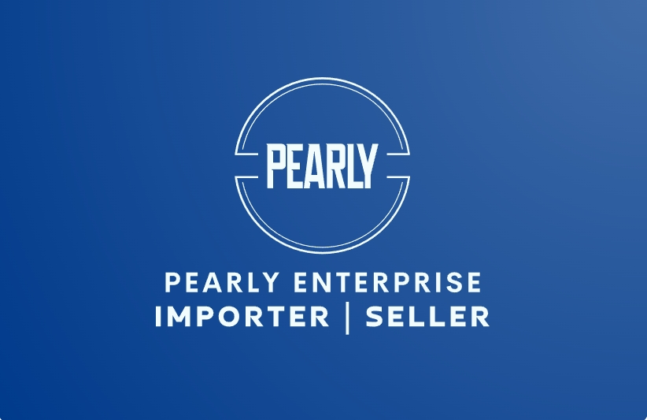

# Pearly Enterprise (পার্লি এন্টারপ্রাইজ)

> **Premier Importer & Wholesale Supplier of High-Carbon & Stainless Steel Spring Wire**  
> Serving industrial manufacturers and small entrepreneurs across Bangladesh from Nawabpur, Dhaka.



[](https://pages.cloudflare.com/)
[](https://developer.mozilla.org/)
[](#)
[](#)

---

## 📌 About Pearly Enterprise

**Pearly Enterprise** is a leading wholesale and retail importer of spring raw materials based in **Nawabpur Road, Dhaka** — the industrial hardware capital of Bangladesh. 

- **Carbon Steel Spring Wire**: Direct factory sourcing from certified partner mills in **China** across **30+ standard wire gauge sizes**.
- **Stainless Steel Spring Wire**: Premium anti-corrosion spring wire imported directly from **India**.
- **Flexible Ordering**: Handling both large-scale container indents for industrial plants and retail batch supplies supporting small entrepreneurs.
- **100% Legal Compliance**: Fully registered under Bangladesh Law with up-to-date Trade License, BIN, VAT, and TIN credentials.

---

## 🚀 Key Website Features

- **Blazing Fast & Zero Dependencies**: Built with pure, semantic HTML5, modern CSS3, and lightweight vanilla JavaScript. No heavy frameworks, no bloated bundles, and zero build step.
- **Dual Color Schemes (Light & Dark Blue)**:
  - **Normal (Light) Mode**: Clean corporate light theme with high-contrast text.
  - **Dark (Blue) Mode**: Deep industrial navy/cobalt blue palette (`#061426` / `#0a1f38`) optimized for low-glare viewing.
  - Switchable in real-time via the navbar toggle button with user preference saved in `localStorage`.
- **Interactive 3D Depth Image Carousels**:
  - Centered presentation showcasing partner mills in China and the Nawabpur warehouse in Dhaka.
  - 3D peek cards with background drop-shadows flanking the active center photo.
  - Click-to-center transitions and touch swipe navigation for mobile devices.
  - Clean thumbnail strip with zero scrollbar clutter.
  - Built-in modal lightbox to view high-resolution photos.
- **Technical Wire Gauge Specification Guide (SWG 1 to SWG 34)**:
  - Complete reference table with gauge conversions in both millimeters (**mm**) and inches (**in**).
  - Instant live search by gauge number, diameter, or units.
  - Category filters: *All Sizes (34)*, *Top Spring Sizes (SWG 6–28)*, *Heavy Gauge (SWG 1–5)*, *Medium Gauge (SWG 6–18)*, and *Fine Gauge (SWG 19–34)*.
  - 1-Click WhatsApp inquiry button with pre-filled gauge specifications for instant quotes.
- **Direct Communication Tools**:
  - Click-to-chat WhatsApp direct links on every product and wire gauge row.
  - 1-Click copy button for WeChat IDs with visual toast confirmation.
  - Interactive contact form with automated email client fallback.
- **SEO & Search Visibility**:
  - Schema.org JSON-LD structured data for `LocalBusiness`.
  - Open Graph and Twitter Card social media meta tags.
  - Semantic HTML landmarks for accessibility and search ranking.

---

## 📂 Project Architecture

```
d:\Pearly\Website\
├── index.html                  # Main responsive single-page application
├── css/
│   └── style.css               # Complete responsive stylesheet (Light & Dark-Blue modes)
├── js/
│   └── main.js                 # Vanilla interaction engine (carousels, wire gauge, theme toggle)
├── images/                     # Optimized web assets
│   ├── logo/                   # Brand circular emblems and banners
│   ├── products/               # Wire coils and product photography
│   ├── factory/                # China supplier factory and drawing machine photos
│   ├── shop/                   # Dhaka store front, showroom, and warehouse photos
│   └── cards/                  # Official visiting card front/back
├── Resources/                  # Renamed high-resolution original source files & documents
├── DEPLOY_TO_CLOUDFLARE.md     # Step-by-step deployment guide for Cloudflare Pages
├── .gitignore                  # Git ignore rules for OS and IDE files
└── README.md                   # Repository documentation
```

---

## 🛠️ Local Development & Preview

Because this website uses pure static web standards, **no build step or package installation (`npm install`) is required**.

### Option 1: Direct File Preview
Simply double-click `index.html` in your file explorer to open it in Google Chrome, Microsoft Edge, Mozilla Firefox, or Safari.

### Option 2: Local HTTP Server (Optional)
If you prefer running a local development server:

```bash
# Using Python (built-in):
python -m http.server 8000

# Or using Node.js:
npx serve .
```
Then visit `http://localhost:8000` in your web browser.

---

## ☁️ Deployment (Cloudflare Pages - 100% Free Forever)

This website is pre-configured for free, automatic deployment on **Cloudflare Pages** via GitHub (works with both **Public** and **Private** repositories).

### One-Time Git Setup:
```bash
# 1. Initialize and add files
git add .
git commit -m "Initial release of Pearly Enterprise website"

# 2. Link your GitHub repository
git remote add origin https://github.com/rabbihasanhimel/pearly-enterprise.git
git push -u origin main
```

### Connect to Cloudflare:
1. Go to [dash.cloudflare.com](https://dash.cloudflare.com/) and navigate to **Workers & Pages** &rarr; **Create application** &rarr; **Pages** &rarr; **Connect to Git**.
2. Select your `pearly-enterprise` repository (even if set to **Private**).
3. Build Configuration:
   - **Framework preset**: `None`
   - **Build command**: *(leave blank)*
   - **Build output directory**: `/` *(root)*
4. Click **Save and Deploy**.

Your site will instantly go live at `https://pearlyenterprise.pages.dev` with free automatic SSL, worldwide DDoS protection, and global CDN delivery.

---

## 🔄 Future Updates Workflow

Whenever you make changes or add new photos, updating your live website takes seconds:

### Adding New Photos to the Gallery:
1. Place your new image file inside `images/shop/` or `images/factory/`.
2. Open `js/main.js` and add an entry to `shopGalleryData` or `factoryGalleryData`:
   ```javascript
   {
     src: "images/shop/your-photo-name.jpg",
     title: "New Inventory Arrival",
     subtitle: "High-carbon spring wire stock in Dhaka",
     caption: "Ready stock coils organized for client dispatch"
   }
   ```
3. Push your update:
   ```bash
   git add .
   git commit -m "Added new warehouse photos"
   git push
   ```
4. Cloudflare will automatically detect the push and redeploy your live website within 15 seconds.

---

## 📞 Company Contact & Verification

- **Proprietor**: MD. Nurul Amin
- **Showroom & Sales Desk**: 233/E, Nawabpur Mansion, Nawabpur Road, Dhaka-1100, Bangladesh
- **Telephone**: [+880 2-41053025](tel:+880241053025)
- **WhatsApp / Mobile**: [+880 1731-658448](https://wa.me/8801731658448)
- **Email**: [info.pearlyenterprise@gmail.com](mailto:info.pearlyenterprise@gmail.com)
- **WeChat ID**: `mdnurulamin1`
- **Business Status**: Registered Importer & General Order Supplier in Bangladesh
# pearly_enterprise
